# Explainable AI Credit Risk Decision Platform


## Live Demo

[https://ai-credit-risk-decision-platformgit-wn9hwdskx57r5qsgrlj8km.streamlit.app/]

The application can be run locally using Streamlit and FastAPI.

<p align="center">
  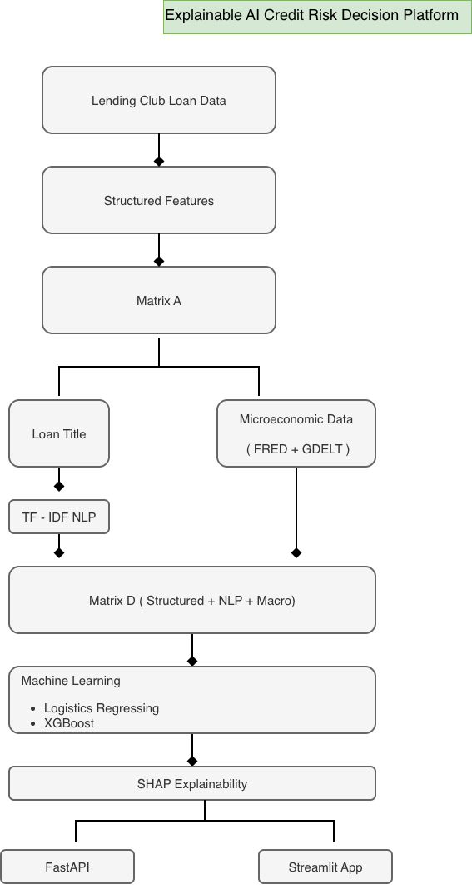
</p>

---

---

# 🖥️ Application Preview

## Streamlit Dashboard

The home page provides an overview of the Explainable AI Credit Risk Decision Platform and allows users to navigate through the prediction workflow.

<p align="center">
  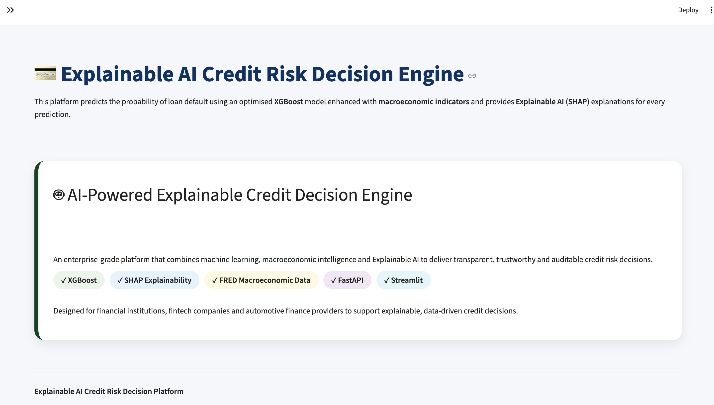
</p>

---

## Credit Risk Prediction

Internal Users(Credit risk team) enter borrower information to generate a real-time credit risk prediction.

<p align="center">
  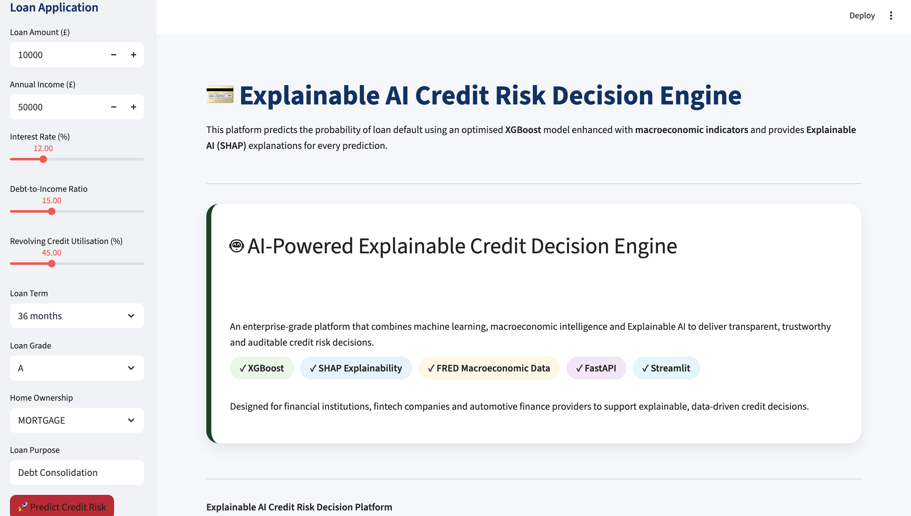
</p>

---

## Prediction Results

The dashboard returns the predicted risk class together with the default probability and confidence score.

<p align="center">
  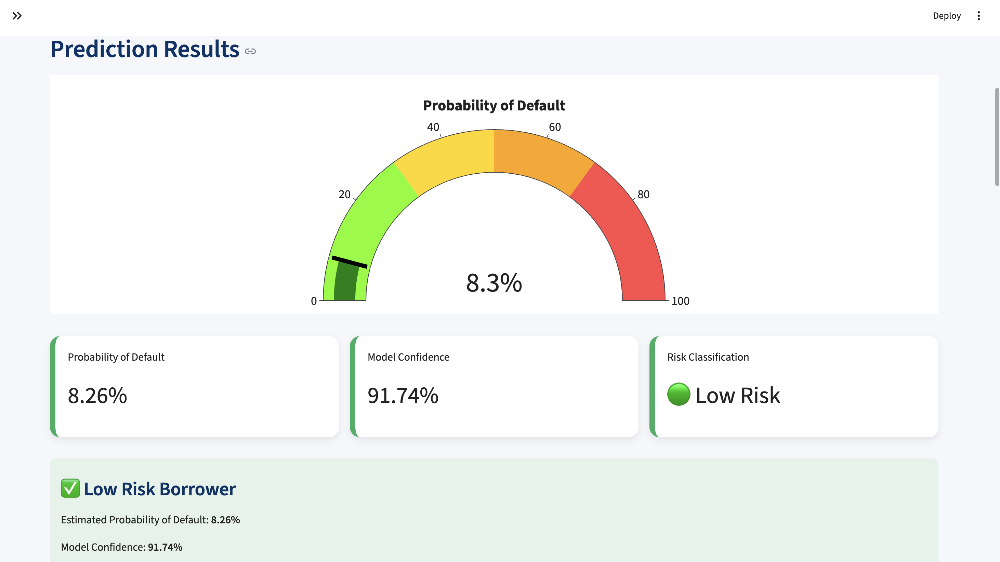
</p>

<p align="center">
  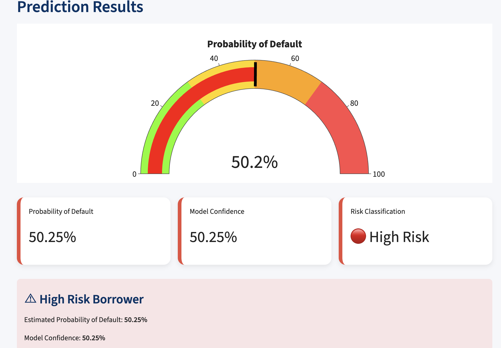
</p>

---

## Low-Risk Borrower Example

Example prediction showing a borrower classified as **Low Risk**.

<p align="center">
  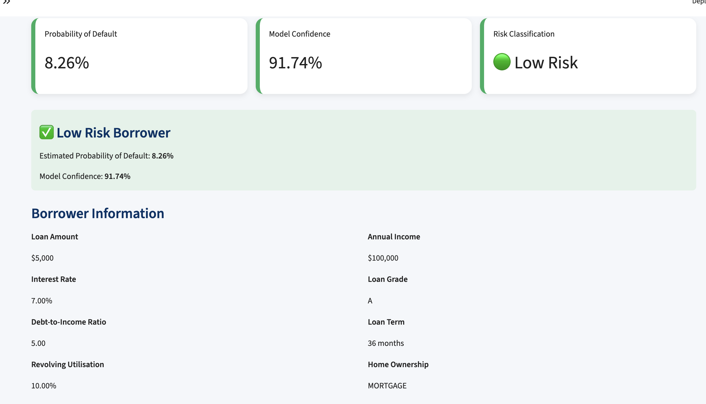
</p>

---

## High-Risk Borrower Example

Example prediction showing a borrower classified as **High Risk**.

<p align="center">
  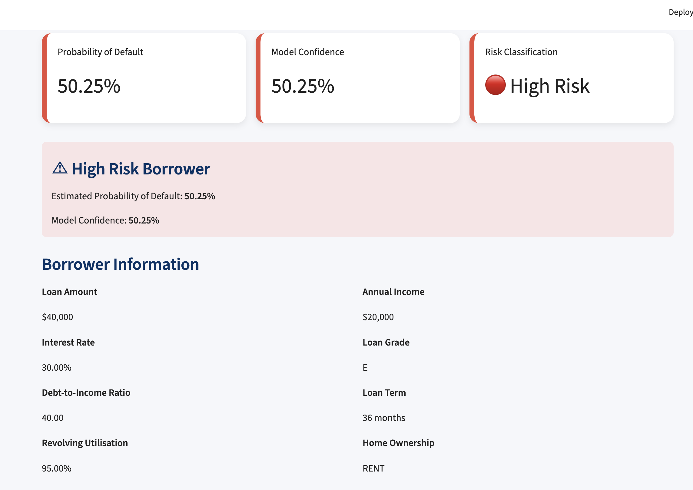
</p>

---

# 🧠 Explainable AI

The platform provides transparent explanations for every prediction using SHAP and an AI-generated decision summary.

## SHAP Summary Plot

Global feature importance across the dataset.

<p align="center">
  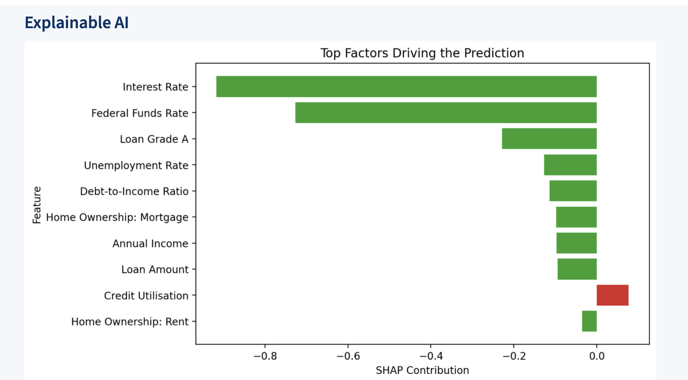
</p>

---

## SHAP Waterfall Plot

Feature-level explanation for an individual borrower prediction.

<p align="center">
  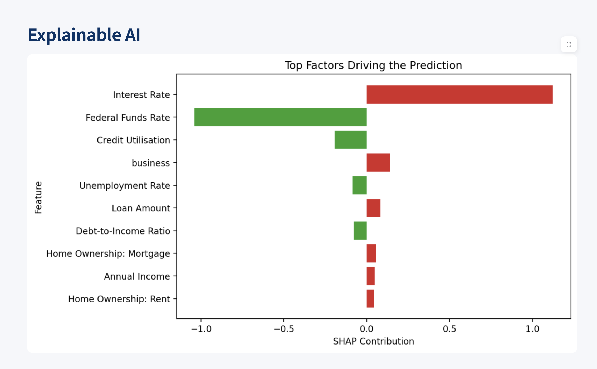
</p>

---

## Top Prediction Features

Displays the most influential features contributing to the model's decision.

<p align="center">
  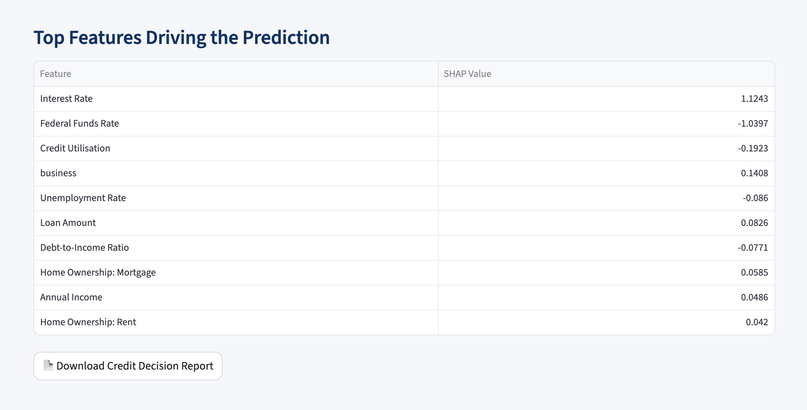
</p>

---

## AI Decision Summary

The AI-generated explanation translates the model output into a business-friendly credit decision summary.

<p align="center">
  
</p>

<p align="center">
  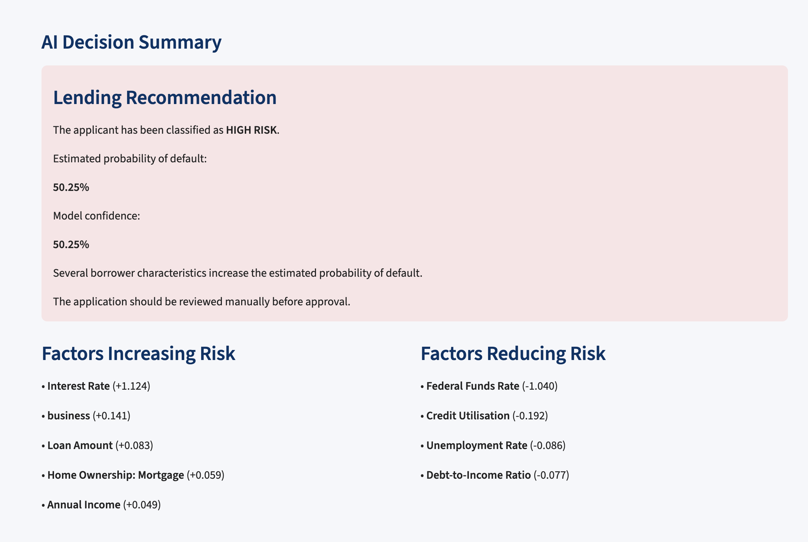
</p>


## Overview

This project presents an end-to-end Explainable AI Credit Risk Decision Platform that combines structured borrower information, NLP-driven text intelligence, and macroeconomic indicators to support transparent lending decisions.

The platform integrates machine learning, natural language processing (NLP), explainable AI (SHAP), and interactive web technologies to demonstrate how modern financial institutions can improve credit risk assessment while maintaining model transparency.

The project compares interpretable and advanced machine learning models using progressively enriched feature sets:

- Matrix A – Structured borrower features
- Matrix C – Structured features + NLP (TF-IDF)
- Matrix D – Structured features + NLP + Macroeconomic indicators

The final system includes:

- Explainable Machine Learning
- SHAP model interpretation
- FastAPI prediction service
- Streamlit decision dashboard
- Enterprise-ready machine learning pipeline

---

## Key Features

- End-to-end credit risk modelling pipeline
- Structured borrower feature engineering
- NLP feature extraction using TF-IDF
- Macroeconomic feature integration (FRED)
- News intelligence integration (GDELT)
- Logistic Regression baseline model
- XGBoost production model
- SHAP explainability
- FastAPI REST API
- Streamlit web application

---

# System Architecture

```text
                     Lending Club Loan Data
                               │
                               ▼
                  Structured Feature Engineering
                               │
                               ▼
                        Matrix A (Structured)
                               │
                               ├──────────────┐
                               ▼              │
                     Loan Title / Purpose      │
                               │              │
                               ▼              │
                          TF-IDF Vectoriser    │
                               │              │
                               ▼              │
                        Matrix C (A + NLP) ◄──┘
                               │
                               ▼
             Macroeconomic Indicators (FRED API)
                               │
                               ▼
                News Intelligence Features (GDELT)
                               │
                               ▼
                 Matrix D (Structured + NLP + Macro)
                               │
                               ▼
               Logistic Regression & XGBoost Models
                               │
                               ▼
                    SHAP Explainability Engine
                               │
                  ┌────────────┴────────────┐
                  ▼                         ▼
            FastAPI REST API         Streamlit Dashboard
```

---

# Datasets

| Dataset | Purpose |
|----------|---------|
| Lending Club Loan Data | Borrower demographics, loan characteristics and loan outcomes |
| FRED Macroeconomic Data | Interest rates, treasury yields and economic indicators |
| GDELT Global Event Database | News-based economic signals and sentiment features |

---

# Machine Learning Pipeline

The project follows a production-oriented machine learning workflow:

1. Data acquisition
2. Data quality assessment
3. Data preprocessing
4. Exploratory data analysis
5. NLP feature engineering
6. Structured feature engineering
7. Macroeconomic feature engineering
8. Matrix construction
9. Model training
10. Hyperparameter optimisation
11. Explainable AI using SHAP
12. Model deployment with FastAPI
13. Interactive decision support using Streamlit

---

# Technology Stack

| Category | Technologies |
|----------|--------------|
| Programming | Python |
| Machine Learning | Scikit-learn, XGBoost |
| NLP | TF-IDF |
| Explainable AI | SHAP |
| API | FastAPI |
| Dashboard | Streamlit |
| Data Processing | Pandas, NumPy |
| Visualisation | Matplotlib, Plotly |
| Version Control | Git, GitHub |

---

# Model Performance

Two machine learning models were evaluated across progressively enriched feature sets.

| Model | Matrix | ROC-AUC | Description |
|--------|---------|---------|-------------|
| Logistic Regression | Matrix A | 0.699 | Baseline model using structured borrower data |
| Logistic Regression | Matrix C | 0.700 | Structured data with NLP features |
| Logistic Regression | Matrix D | 0.719 | Structured, NLP and macroeconomic features |
| XGBoost | Matrix A | 0.722 | Advanced gradient boosting model |
| XGBoost | Matrix C | 0.722 | Structured + NLP |
| XGBoost | Matrix D | 0.725 | Final production model |

---

# Explainable AI

Model predictions are explained using SHAP (SHapley Additive exPlanations).

The explainability module enables users to:

- Understand why a borrower is classified as high or low risk.
- Identify the most influential borrower characteristics.
- Improve model transparency for responsible AI and regulatory compliance.
- Support human decision-making rather than replacing it.

Example SHAP outputs include:

- Global feature importance
- Individual borrower explanations
- Waterfall plots

---

# Deployment

The project demonstrates how an explainable machine learning model can be deployed as a decision-support application.

Components include:

- FastAPI REST API
- Streamlit interactive dashboard
- Saved preprocessing pipeline
- Trained machine learning model
- Automated prediction workflow

---

# Repository Structure

```text
ai-credit-risk-decision-platform/
│
├── notebooks/
├── app/
├── dashboard/
├── data/
├── feature_store/
├── models/
├── reports/
├── assets/
├── README.md
├── requirements.txt
└── .gitignore
```

---

# Installation

Clone the repository

```bash
git clone https://github.com/EAhadzi-byte/ai-credit-risk-decision-platform.git
```

Move into the project directory

```bash
cd ai-credit-risk-decision-platform
```

Install dependencies

```bash
pip install -r requirements.txt
```

Run the Streamlit application

```bash
streamlit run app.py
```

Run the FastAPI server

```bash
uvicorn api:app --reload
```

---

# Future Improvements

Future development will include:

- LightGBM and CatBoost benchmarking
- Automated model monitoring
- Docker containerisation
- Azure cloud deployment
- Continuous integration and deployment (CI/CD)
- Real-time credit scoring APIs
- Expanded explainability dashboards

## Skills Demonstrated

- Machine Learning
- Explainable AI (SHAP)
- Credit Risk Modelling
- NLP (TF-IDF)
- Feature Engineering
- FastAPI
- Streamlit
- Git & GitHub
- Python
- Pandas
- Scikit-learn
- XGBoost

---

# Author

**Emmanuel Saka Ahadzi**

MSc Data Science  
Nottingham Trent University

This project was developed as part of a research initiative exploring Explainable AI for transparent credit risk assessment using structured borrower data, NLP, and macroeconomic intelligence.
